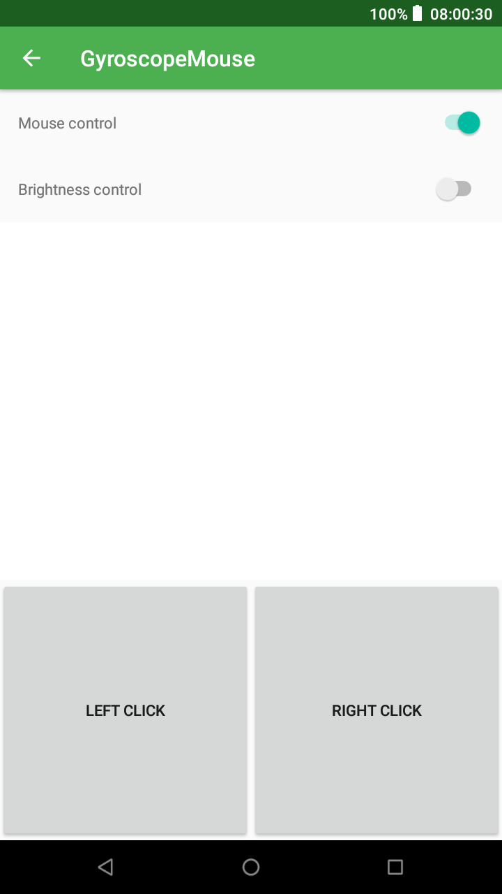
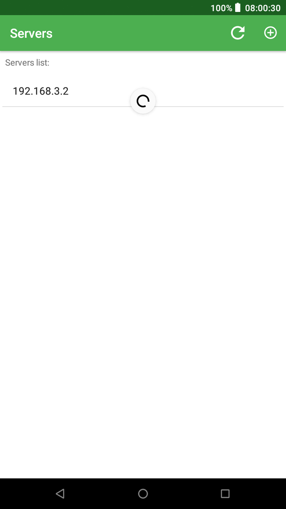

# GyroMouse
Control your Linux PC with Android device

GyroMouse consists of two applications:
- server (written in C, for Linux) that executes commands from the client
- client (written in Kotlin) that sends commands to the server

Communication is done by utilizing UDP procotol. Client and server supports mouse control (using gyroscope), PC's brightness control (using phone's light sensor) and server discovery (using UDP broadcast on the client).

